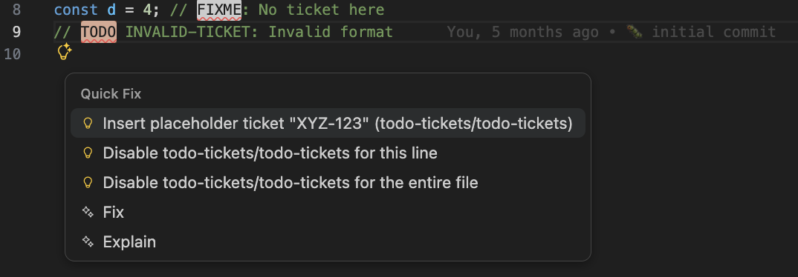

# eslint-plugin-todo-tickets

ESLint plugin to enforce TODO comments with ticket numbers (JIRA, GitHub issues, etc.)

> [!NOTE] Disclaimer 1:
> This plugin was initially vibe-coded in a rush, but I promise, I reviewed the code and tested it.

> [!TIP] Disclaimer 2:
> Before I push this mess I found similar projects:
> - [eslint-plugin-todo-plz](https://github.com/sawyerh/eslint-plugin-todo-plz)
> - [eslint-plugin-jira-ticket-todos](https://www.npmjs.com/package/eslint-plugin-jira-ticket-todos)
>
> I should've googled things before, but yeah, here am I, procrastinating and re-inventing the wheel.


## Installation

```bash
npm install --save-dev eslint-plugin-todo-tickets
```

## Usage

Add `todo-tickets` to the plugins section of your `.eslintrc` configuration file:

```json
{
  "plugins": ["todo-tickets"],
  "extends": ["plugin:todo-tickets/recommended"]
}
```

Or using eslint.config.mjs:

```javascript
import js from '@eslint/js';
import todoTickets from 'eslint-plugin-todo-tickets';

export default [
  js.configs.recommended,
  ...todoTickets.configs['flat/recommended'],
  {
    files: ['**/*.js'],
    // rule customizations go here
  }
];
```


### Suggestions and placeholder tickets

Set `suggestPlaceholderWithTicket` to enable ESLint suggestions that insert a placeholder ticket for you. When you provide a placeholder, the plugin will also infer the appropriate default ticket pattern (e.g., `XYZ-000` locks onto the JIRA-style regex, `#00` switches to GitHub issues). Example:

```json
{
  "rules": {
    "todo-tickets/todo-tickets": [
      "error",
      {
        "suggestPlaceholderWithTicket": "XYZ-000",
        "keywords": ["TODO", "FIXME"]
      }
    ]
  }
}
```

Now, when a TODO is missing a ticket, ESLint will offer a suggestion to insert `XYZ-000`, making it easier to follow up later.




## Configuration

You can customize the ticket patterns and keywords:

```json
{
  "rules": {
    "todo-tickets/todo-tickets": ["error", {
      "ticketPatterns": [
        "[A-Z]{2,}-\\d+",  // JIRA format (e.g., ABC-123)
        "#\\d+"           // GitHub format (e.g., #42)
      ],
      "keywords": ["TODO", "FIXME", "BUG", "HACK"]
    }]
  }
}
```

> Need the flat config version? Start with the snippet in the **Usage** section and add the same rule options shown above to the `rules` field for whichever file set you target.

### Recommended configs at a glance

| Config key | When to use it | Notes |
| --- | --- | --- |
| `plugin:todo-tickets/recommended` | Classic `.eslintrc` style projects | Enables the rule with all default ticket patterns (JIRA + GitHub) |
| `todo-tickets/configs["flat/recommended"]` | Flat config projects | Same defaults as above, ready to spread into your array |
| `todo-tickets/configs["flat/jira-recommended"]` | JIRA-centric teams | Ships with a default placeholder ticket so autofix suggestions are enabled |
| `todo-tickets/configs["flat/github-recommended"]` | GitHub Issue workflows | Uses `#123` style patterns and placeholder suggestions |

Pick the preset closest to your workflow and override rule options only when you need something more specific.

## Examples

### Valid

```javascript
// TODO ABC-123: Fix this issue
// FIXME #42: Something to fix
/* BUG ASMO-42: Important bug */
// HACK MCO-123: Temporary solution
```

### Invalid

```javascript
// TODO: Missing ticket
// FIXME: No ticket here
// TODO INVALID-TICKET: Invalid format
```

## Contributing & Community

Contributions are welcome! Please read the [CONTRIBUTING.md](CONTRIBUTING.md) guide for setup tips, testing instructions, and the preferred workflow. By participating you agree to follow our [Code of Conduct](CODE_OF_CONDUCT.md).

## License

This project is licensed under the MIT License - see the [LICENSE](LICENSE) file for details.